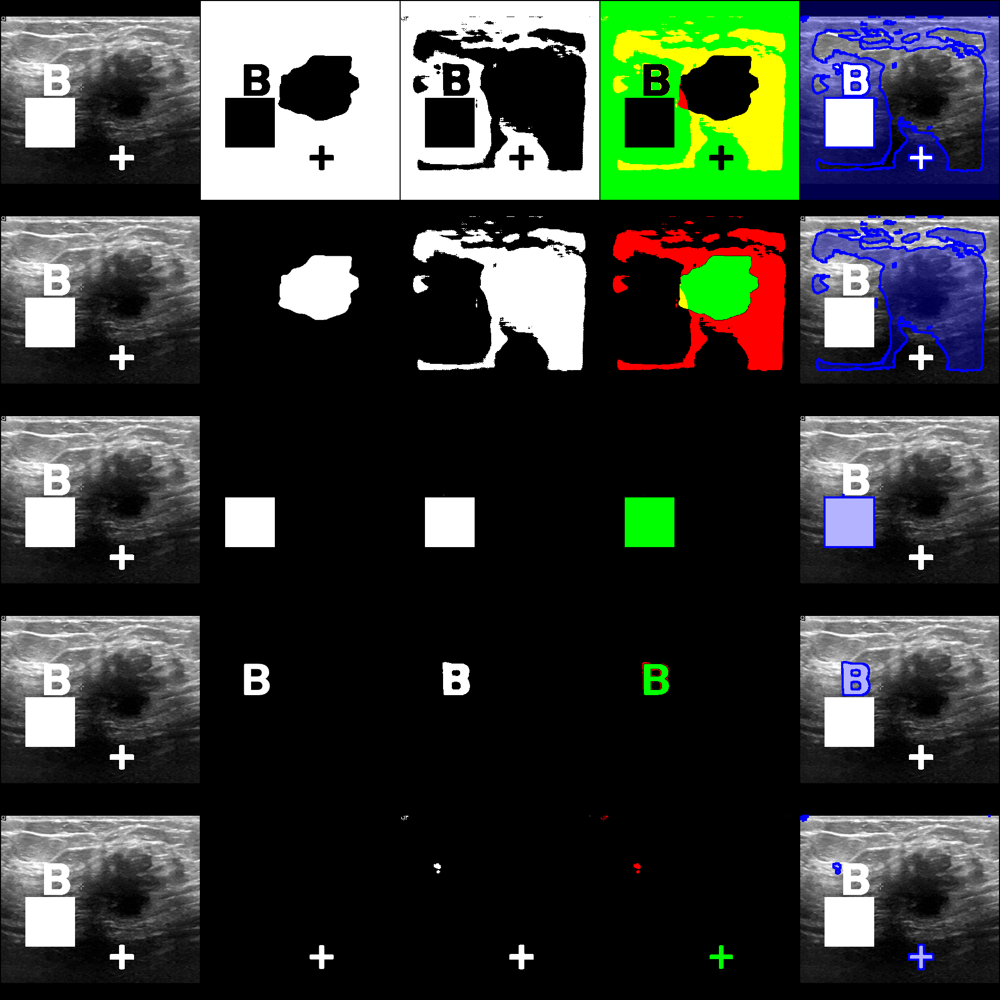
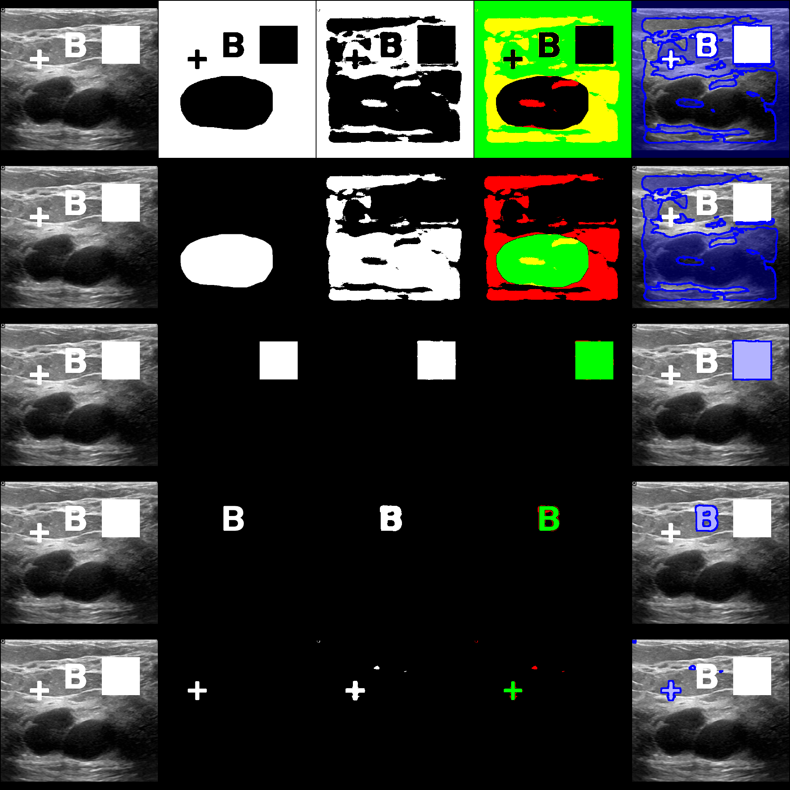
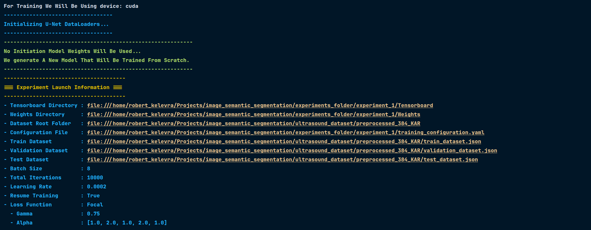
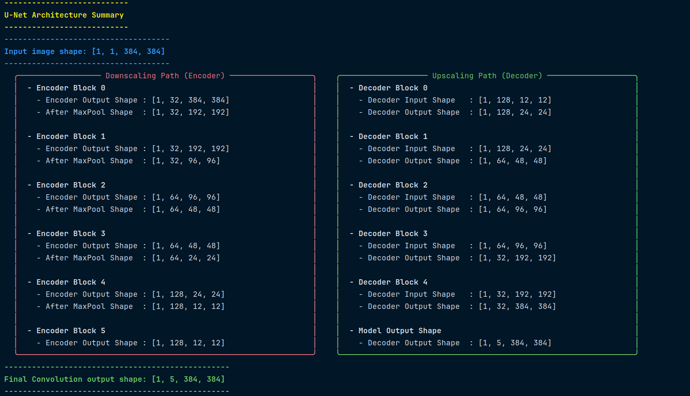
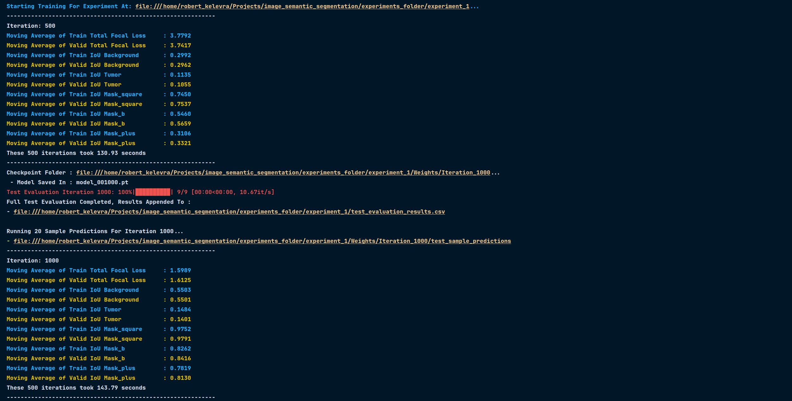
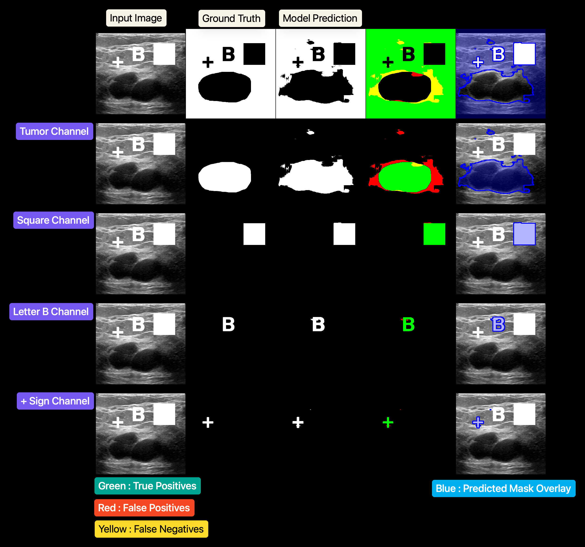
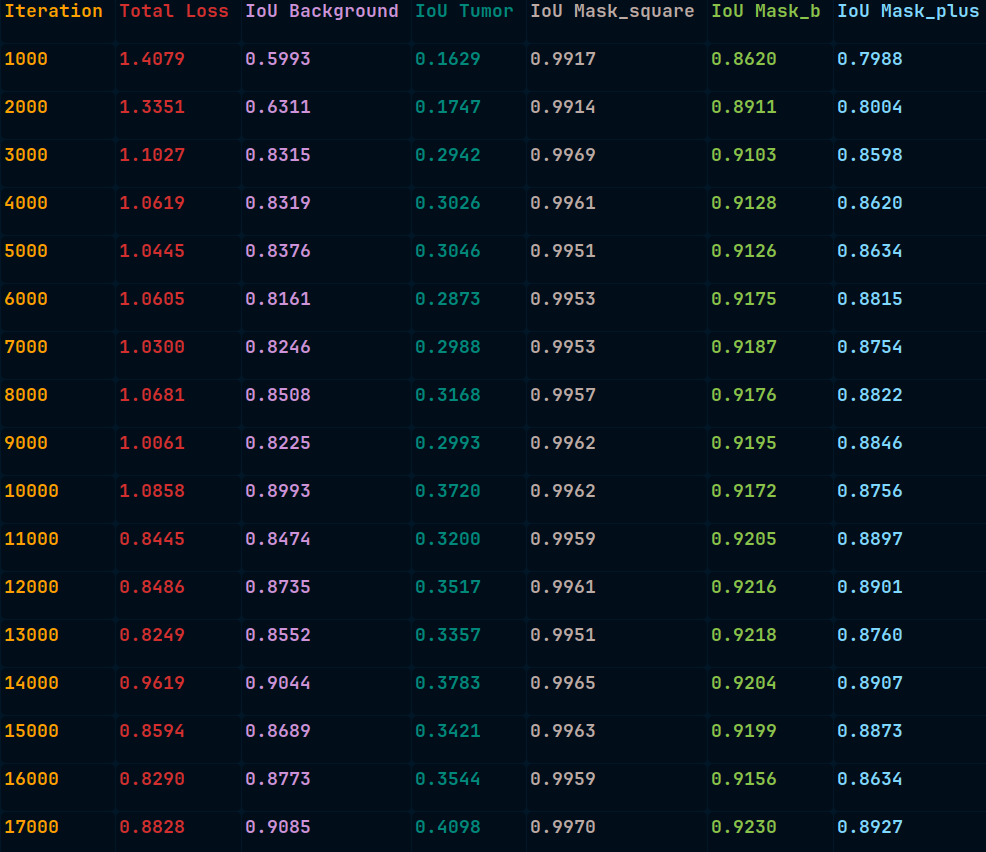
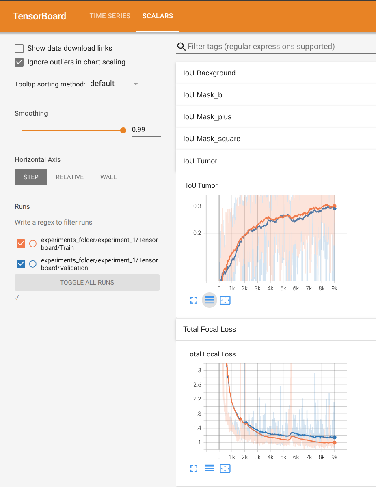

<h1 align="center">Image Semantic Segmentation Pipeline</h1>

<p align="center">
  
  
</p>


## Table of Contents
- [Project Description](#project-description)
- [Prerequisites](#prerequisites)
  - [Package Requirements](#package-requirements)
  - [Data Requirements](#data-requirements)
- [Configuration](#configuration)
- [Training](#training)
- [TensorBoard Monitoring](#tensorboard-monitoring)

## Project Description
This repository contains a PyTorch training pipeline for image semantic segmentation. It utilizes a U-Net architecture to segment and classify pixels on the Breast Ultrasound Images Dataset into multiple labels, including tumor, square, letter B, and plus sign.

The codebase features:
- Automated dataset retrieval and preprocessing from Kaggle.
  - This is how we get the tumor class.
- Generation of synthetic dummy masks for multi-class training.
  - This is used in order to test multi-label segmentation since the original data only has one class.
- Configuration management via YAML files to adjust hyperparameters, dataset paths, and U-Net structural parameters.
  - More details are given in the configuration section that will be detailed later.

## Prerequisites

### Package Requirements
- Python 3.12+
- uv

To install the project requirements, simply run:

```bash
uv sync
```

### Data Requirements
This project uses the Breast Ultrasound Images Dataset from Kaggle, which provides ultrasound scans along with their corresponding tumor masks. Our data pipeline automatically downloads the raw data, cleans it, and generates synthetic shapes (squares, letter B, and plus signs) to simulate a multi-class segmentation task.

To retrieve, preprocess, and split the data into training, validation, and testing sets, run the data retrieval script from the project root:

```bash
uv run app/utilities/data_utilities/data_retrieval.py
```

## Configuration

All training and model parameters are controlled via a YAML configuration file located at `app/configuration/configuration.yaml`. Below is an annotated breakdown of the available settings:

```yaml
ExperimentConfiguration:
  project_root: "/path/to/project"     # Root directory where experiments and logs will be saved
  dataset_folder: "/path/to/data"      # Path to the preprocessed dataset
  expected_input_size: 384             # Input image resolution (width and height)
  information_dump: 500                # Number of iterations between logging metrics
  weight_saving_iterations: 1000       # Number of iterations between saving model checkpoints
  number_iterations: 1e5               # Total number of training iterations
  learning_rate: 2.0e-4                # Learning rate for the optimizer
  loss: "focal"                        # Loss function to use: "classic" (CrossEntropy) or "focal"
  focal_loss_parameters:
    alpha: [ 1.0, 2.0, 1.0, 1.0, 1.0 ] # Class weights for the focal loss function
    gamma: 0.75                        # Focusing parameter for the focal loss function
  dtype: "float32"                     # Data type used for training computations
  batch_size: 8                        # Number of samples per training batch
  compute_validation_iteration: True   # Whether to run validation periodically during training
  resume_training: True                # Whether to resume training from the latest checkpoint
  label_dictionary:                    # Mapping of class names to their numerical IDs
    background: 0
    tumor: 1
    mask_square: 2
    mask_b: 3
    mask_plus: 4

UnetConfiguration:
  input_channels: 1                    # Number of channels in the input image (1 for grayscale)
  output_channels: 5                   # Number of output classes for segmentation
  convolution_blocks:                  # Defines the depth and number of filters in each U-Net block
    {
     "1": [1, 32],                     # Block 1: 1 convolution layer, 32 output channels
     "2": [2, 32],                     # Block 2: 2 convolution layers, 32 output channels
     "3": [4, 64],                     # Block 3: 4 convolution layers, 64 output channels
     "4": [4, 64],                     # Block 4: 4 convolution layers, 64 output channels
     "5": [6, 128],                    # Block 5: 6 convolution layers, 128 output channels
     "6": [6, 128]                     # Block 6: 6 convolution layers, 128 output channels
    }
```

## Training

Once the dataset has been retrieved (as explained in the Data Requirements section) and your `configuration.yaml` is filled out, you can launch the training pipeline. Run the following command from the project root:

```bash
uv run app/main.py
```

When training is launched, you will receive a terminal summary of the configurations you have set. This initialization output ensures you are fully aware of where important inputs (like your dataset splits) and outputs (like your saved weights and TensorBoard logs) are located. Crucially, it provides clickable file links in compatible terminals so you can instantly navigate your project structure. It should look something like this:

<p align="center">
  
</p>

Additionally, you will get a printed view of the model architecture being used. This project utilizes a **U-Net** architecture, a convolutional neural network designed for biomedical image segmentation. The core details of the U-Net include:
- **Encoder (Contracting Path)**: Captures context by progressively reducing the spatial dimensions of the image while increasing the number of feature channels.
- **Decoder (Expanding Path)**: Enables precise localization by upsampling the feature maps and concatenating them with high-resolution features from the encoder via skip connections.
- **Customizable Blocks**: The depth and number of filters in each convolution block can be precisely controlled via the configuration file.

The architecture output in your terminal should look something like this:

<p align="center">
  
</p>

Once training has commenced, the script will output periodic terminal logs detailing the progression of the model. You will see rolling averages for:
- **Total Loss**: The configured loss metric (CrossEntropy or Focal Loss) for both the training and validation sets.
- **Intersection over Union (IoU)**: A metric for each specific class (e.g., tumor, background, square, letter B, plus sign) indicating how well the model's predictions overlap with the ground truth.

At specific intervals (defined by `weight_saving_iterations` in your configuration), the trainer will also:
1. Run a full evaluation over the **test set** to compute the overall test loss and class-specific IoUs.
2. Generate and save visual **image samples** containing the original input, the ground truth mask, and the model's predicted mask side-by-side. These visual outputs can be used for debugging and improving model performance.

The on-the-fly training logs will look like this:

<p align="center">
  
</p>

Additionally, the inferred image samples generated for debugging will look like this:

<p align="center">
  
</p>

Each row in the generated image corresponds to a specific class channel. From left to right, the five columns represent:
1. **Original Image**: The grayscale ultrasound input.
2. **Ground Truth**: The expected binary mask.
3. **Prediction**: The model's predicted binary mask.
4. **Error Map**: Highlights the segmentation accuracy using colors: True Positives are **Green**, False Positives are **Red**, and False Negatives are **Yellow**.
5. **Boundary Overlay**: The original image overlaid with a transparent blue fill and a solid blue boundary contour representing the predicted mask.

In addition to the visual samples, the numerical metrics (test loss and class-specific IoUs) from each test set evaluation are appended to a CSV file in your experiment directory. This allows you to track the performance progression of the model across all saved checkpoints. The CSV log will look like this:

<p align="center">
  
</p>

## TensorBoard Monitoring

To visualize the training and validation metrics in real-time, you can start a TensorBoard server pointing to your logs directory. Run the following command:

```bash
uv run tensorboard --logdir /path/to/your/experiment/Tensorboard
```

This will launch a web interface where you can track the performance of the model. For instance, the image below shows the evolution of the Intersection over Union (IoU) for the tumor class and the evolution of the loss over 9000 iterations:

<p align="center">
  
</p>
